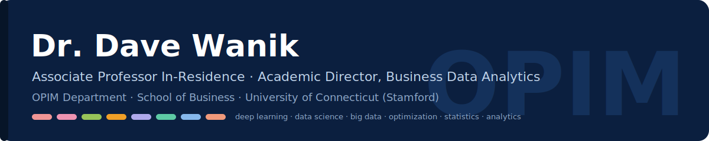
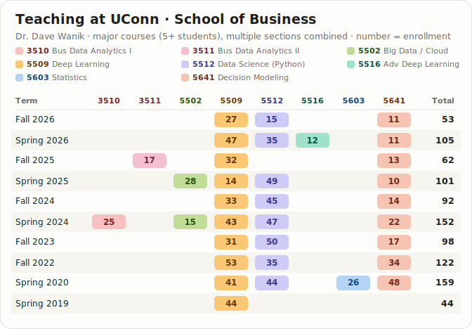

## About

I'm an Associate Professor In-Residence in the Operations and Information Management department at the University of Connecticut (Stamford), and Academic Director for **Business Data Analytics**. I teach and develop the graduate and undergraduate data-science curriculum — optimization, statistics, cloud computing, data science, and deep learning — all hands-on, in Python and Google Colab.

Before joining the faculty full-time, I served as the inaugural Center Manager of the **Eversource Energy Center** at UConn, and I've spent nearly 15 years working with utilities on IoT analytics, natural language processing, remote sensing, and storm-outage forecasting. I also advise **BittBridge Labs**, a student-led experiential learning program in decentralized AI (a UConn collaboration with Yuma/DCG). I'm a three-time UConn alum (BS Environmental Science; MS & PhD Environmental Engineering).

## Highlights

- 🎓 **1,700+ students taught** across 16 consecutive semesters (2019–2026)
- 📚 **8 open-access course companion books** and **450+ Colab notebooks**, free to anyone
- 📈 **1,750+ citations · h-index 17** ([Google Scholar](https://scholar.google.com/citations?user=xyW8xncAAAAJ))
- 🏆 **Excellence in Graduate Teaching Award** (2024) · **Innovation in Teaching Award** (2022), UConn School of Business
- ⚡ Co-developed a **patented storm-outage prediction model**, licensed to a leading weather-analytics company

## Course companion books & notebooks

Every course is taught hands-on in **Python / Google Colab** (or **R**, for statistics). Each has a free, browser-readable **companion book** built from the lecture videos — chapter narratives with per-lecture key points — and most ship a repo of run-anywhere **Colab notebooks**.

| Course | Companion book | Notebooks |
|---|---|---|
| **OPIM 3510** · Business Data Analytics I: Data Storytelling, Applied Stats & Geospatial | [Read online](https://drdave-teaching.github.io/opim3510-textbook/) | [39 notebooks](https://github.com/drdave-teaching/OPIM3510-notebooks) |
| **OPIM 3511** · Business Data Analytics II: ML Fundamentals | [Read online](https://drdave-teaching.github.io/opim3511-textbook/) | [139 notebooks](https://github.com/drdave-teaching/OPIM3511-notebooks) |
| **OPIM 5502** · Big Data Analytics with Cloud Computing | [Read online](https://drdave-teaching.github.io/opim5502-textbook/) | [46 notebooks](https://github.com/drdave-teaching/OPIM5502-notebooks) |
| **OPIM 5509** · Introduction to Deep Learning | [Read online](https://drdave-teaching.github.io/opim5509-textbook/) | [47 notebooks](https://github.com/drdave-teaching/OPIM5509-notebooks) |
| **OPIM 5512** · Data Science Using Python | [Read online](https://drdave-teaching.github.io/opim5512-textbook/) | [43 notebooks](https://github.com/drdave-teaching/OPIM5512-notebooks) |
| **OPIM 5516** · Advanced Deep Learning | [Read online](https://drdave-teaching.github.io/opim5516-textbook/) | [43 notebooks](https://github.com/drdave-teaching/OPIM5516-notebooks) |
| **OPIM 5603** · Statistics in Business Analytics | [Read online](https://drdave-teaching.github.io/opim5603-textbook/) | — |
| **OPIM 5641** · Business Decision Modeling | [Read online](https://drdave-teaching.github.io/opim5641-textbook/) | [93 notebooks](https://github.com/drdave-teaching/OPIM5641-notebooks) |

*Also teach: **OPIM 3802** Data & Text Analytics.*

🗺️ **[Skills Atlas](https://github.com/drdave-teaching/opim-skills-atlas)** — a cross-course map of every skill taught, how the courses build on each other, and how each skill is practiced (by hand · in code · in the cloud).

## Teaching at UConn

Every fall and spring since 2019 — often **4–5 courses and 100+ students a semester**, colored by subject:

Major courses (5+ students); multiple sections of a course combined. Deep Learning has run since 2019: first as OPIM 5894 (special topics), then as OPIM 5509.

## Research

My research sits at the intersection of **machine learning and natural-hazard resilience**: storm-outage prediction for electric utilities, weather-impact modeling with remote sensing and LiDAR, energy analytics, and coastal-population dynamics.

**Selected publications** ([full list on Google Scholar](https://scholar.google.com/citations?user=xyW8xncAAAAJ)):
- *Accelerating growth of human coastal populations at the global and continent levels: 2000–2018* (2024)
- *Predicting storm outages through new representations of weather and vegetation* (2019)
- *Machine learning using combined structural and chemical descriptors for prediction of methane adsorption performance of MOFs* (2017)
- *Storm outage modeling for an electric distribution network in Northeastern USA* (2015)

## Technical areas

**Machine Learning & AI** — deep learning (CNNs, RNNs, LSTMs, transformers) · time-series prediction & forecasting · model explainability, causal ML

**Optimization & Decision Science** — linear, nonlinear, and integer programming · Pyomo, Gurobi, OR-Tools · applications in finance, energy, manufacturing

**Cloud Computing & DevOps** — Google Cloud Platform (Cloud Functions Gen2, Cloud Run Jobs, Cloud Scheduler) · GitHub Actions CI/CD · Workload Identity Federation · serverless ETL pipelines · BigQuery · Cloud Storage

**Data Engineering** — PySpark · distributed compute · Databricks · large-scale geospatial & remote sensing (GRIB, NetCDF, HRRR) · IoT data ingestion and pipeline automation

**Decentralized AI** — faculty advisor to **BittBridge Labs** (UConn × Yuma/DCG) · deep-learning time-series models deployed on decentralized networks (Bittensor)

---

📍 School of Business, University of Connecticut — Stamford campus · Everything on this page (books, notebooks, code) is open — use it, fork it, learn from it.
